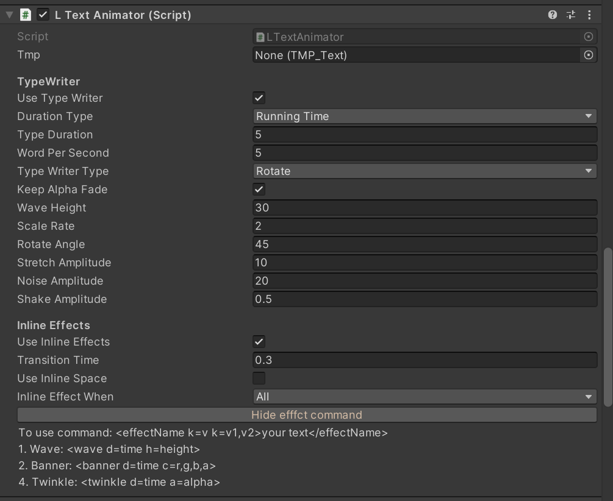

# Animation

我们提供了两种方法进行补间动画，一种是 `new` 一个对象，另一种是通过 `Coroutine` 的方法

## LAnimation

`new LAnimation()` 创建了一个动画，其构造函数接受两个参数

```csharp
public LAnimation(Action<float> action, AnimationOptions _options)
```

其中 `Action<float> action` 是一个 onUpdate 回调函数，每帧不断调用。回调函数接受一个 `float` 参数，代表 `0-1`
之间采样值，注意这个采样值是非线性的，由动画曲线 `_options.curve` 决定 

`AnimationOptions _options` 参数决定了动画属性，定义如下

```csharp
public struct AnimationOptions
{
  // 动画时长
  public float duration;
  // 动画延迟
  public float delay;
  // 每次重复，是否都进行延迟，否的话只会在第一次延迟，后面循环不再延迟
  public bool delayInIterations;
  // 动画方向
  public AnimationDirection direction;
  public enum AnimationDirection
  {
    // 前向动画
    NORMAL,
    // 反向动画
    REVERSE,
    // 每次都会改变方向
    ALTERNATE
  }

  // 动画曲线
  public LCurveType curve;

  // 动画结束是否保留状态
  public AnimationFill fill;
  public enum AnimationFill
  {
    // 动画结束回到初始
    BACKWARDS,
    // 保留动画结束
    FORWARDS,
  }

  // 循环播放次数，-1 代表无限循环播放
  public int iterations;

  // 动画结束后是否删除动画
  public bool removeOnCompleted;

  // 动画事件
  public Action onCompleted;
  public Action onWaitDelay;
  public Action onUpdate;
  public Dictionary<float, Action> onFrameDict;  // 帧回调函数

  public Action<LAnimationStateStruct> onCompletedParam;
  public Action<LAnimationStateStruct> onUpdateParam;
  public Action<LAnimationStateStruct> onWaitDelayParam;
  public Dictionary<float, Action<LAnimationStateStruct>> onFrameDictParam;
}
```

动画事件回调函数分为有参数和无参数的，有参数的回调会获取到一个 `LAnimationStateStruct` 类型的参数，代表了当前动画播放各种的状态

```csharp
public struct LAnimationStateStruct
{
  public AnimationOptions options;

  public bool Paused; // 是否暂停
  public bool Stoped; // 是否停止
  public bool Completed; // 是否结束
  public int iter_count; // 第几次循环中
  public float t; // 当前采样值
}
```

### 使用例子

```csharp
public class AnimationTest : MonoBehaviour
{
  public Vector3 start;
  public Vector3 end;

  [SerializeField]
  public AnimationOptions opt;

  private LAnimation move;

  void Start()
  {
    move = new LAnimation((t) =>
    {
      // t 是由动画曲线决定了非线性，因此这里直接线性插值即可
      transform.position = Vector3.Lerp(start, end, t);
    }, opt);
  }

  private void Update()
  {
    if (Input.GetKeyDown(KeyCode.A))
    {
      move.RePlay();
    }
    if (Input.GetKeyDown(KeyCode.P))
    {
      move.Pause();
    }
    if (Input.GetKeyDown(KeyCode.R))
    {
      move.Resume();
    }
    if (Input.GetKeyDown(KeyCode.S))
    {
      move.Stop();
    }
  }

  private void FixedUpdate()
  {
    // 必须要调用 Update() 来更新动画 
    move.Update(Time.fixedDeltaTime);
  }
}
```

<mark>Tips:</mark> 这种方式一定要在 `FixedUpdate()` 中调用动画对象的 `Update()` 方法来更新动画，否则运动不起来的 

## LAnimationCoroutine

这是一个静态类，通过协程来进行动画处理，通过 `MakeAnimation()` 静态方法来创建一个动画，其接受的参数和 `LAnimation` 的构造函数参数一致，但返回的是一个动画 ID，后续通过这个 ID 来控制动画

### 使用例子

```csharp
public class AnimationTest : MonoBehaviour
{
  public Vector3 start;
  public Vector3 end;

  [SerializeField]
  public AnimationOptions opt;

  private string aniId;

  void Start()
  {
    aniId = LAnimationCoroutine.MakeAnimation((t) =>
    {
      transform.position = Vector3.Lerp(start, end, t);
    }, opt);
  }

  private void Update()
  {
    if (Input.GetKeyDown(KeyCode.A))
    {
      LAnimationCoroutine.RePlayC(aniId);
    }
    if (Input.GetKeyDown(KeyCode.P))
    {
      LAnimationCoroutine.PauseC(aniId);
    }
    if (Input.GetKeyDown(KeyCode.R))
    {
      LAnimationCoroutine.ResumeC(aniId);
    }
    if (Input.GetKeyDown(KeyCode.S))
    {
      LAnimationCoroutine.StopC(aniId);
      // LAnimationCoroutine.RemoveC(aniId);
    }
  }
}
```

可以看到为了区分，每个方法后面都加了 `C` 来代表是协程动画

<mark>Tips:</mark> 这种方式一定要在场景中挂载 `SKCommonTimer` 组件，否则运动不起来的

## LAnimationCoroutineGroup

当我们想将一组动画进行共同控制，而不影响其余动画，这时就可以使用 `LAnimationCoroutineGroup` 先创建一个动画组，然后通过动画组来创建并控制动画

```csharp
void Start()
{
  // 新建动画组
  LAnimationCoroutineGroup aniGroup = new LAnimationCoroutineGroup()
  // 通过动画组来创建动画
  aniId = aniGroup.MakeAnimation((t) =>
  {
    transform.position = Vector3.Lerp(start, end, t);
  }, opt);
  // 通过动画组来控制动画
  aniGroup.RePlayC(aniId)
}
```

## LTextAnimator

基于 `TextMeshPro` 封装的打字机效果组件，直接往带有 `TextMeshPro` 组件的 `UI` 对象上挂载即可



该组件内置了许多打字机 `TypeWriter` 效果，并且也有行间动画 `Inline Effects` 的效果，行间动画采用标记语言进行标记

<mark>Tips:</mark> 目前该组件内置按 `Q` 进行播放，按 `O` 跳过播放