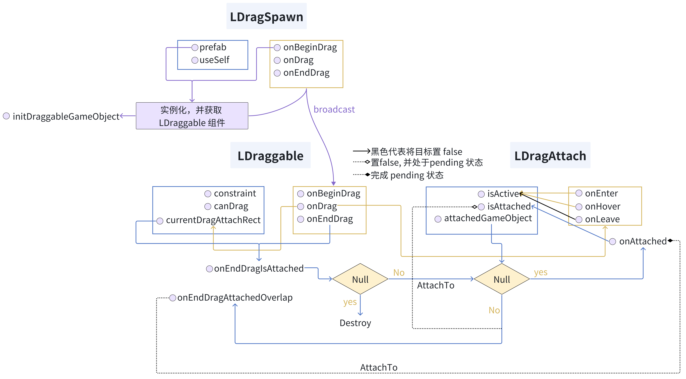

# Drag

该模块实现了拖拽的功能

## LDraggable

该组件表明一个 UI 对象是可拖拽的

- `constraint` 属性代表拖拽范围限制
- `IsDragging` 属性代表是否正在拖拽
- `canDrag` 是否可以拖拽
- `dragAttachList` 可接受区域 `LDragAttach` 目标位置数组，可以通过 `UpdateDragAttachList()` 来更新可接受区域目标位置数组
- `CurrentDragAttachRect` 拖拽过程中接触到的可接受区域目标位置，在 `onDrag` 中会更新
- `data = new object();` 拖拽对象关联的数据，这个在 `LDragSpawn` 生成一个可拖拽对象时很有帮助，可以区分生成的不同拖拽对象，`draggable.data = new { id };`

#### Events

- `onBeginDrag` 开始拖拽回调，可以用来初始化设置一些<mark>拖拽数据</mark>
- `onDrag` 拖拽中，可以用来判断是否接触到<mark>可接受区域</mark>，在这个过程中会触发 `LDragAttach` 的 `Events` 来尝试激活目标区域
- `onEndDrag` 拖拽结束，尝试进行 `AttachTo`
- `onEndDragIsAttached(GameObject)` 吸附的回调，若参数为 `null` 代表没有停留在可接受区域，直接销毁该可拖拽对象，否则参数代表吸附的目标区域位置，并且完成了吸附
- `onEndDragAttachedOverlap` attached 冲突时触发

```csharp
public UnityEvent<GameObject, GameObject, GameObject> onEndDragAttachedOverlap
```

第一个参数代表已经吸附的 draggable 对象。第二个参数代表将要吸附的 draggable 对象。第三个参数代表可接受区域目标对象

一定要注意，一旦冲突是一个 `padding` 的过程，我们将会设置目标区域的 `LDragAttach.IsAttached=false`，并且由这个回调来进行决定最后吸附哪一个（第一个参数还是第二个参数），一旦再次完成吸附，`LDragAttach.IsAttached=true`

## LDragAttach

该组件表明一个 UI 对象是可接受区域，能够吸附可拖拽对象

- `useDefaultAction` 使用默认的 `Events(OnHover\OnLeave\OnEnter)` 来进行响应，默认是改变颜色
- `hoverColor` 当有 draggable 对象 hover 改变颜色
- `cancelDrag` 一旦吸附了 draggable 对象，则该对象不可以再次拖出，除非有 dragspawn 组件
- `IsActive` 是否接触了 draggable 对象
- `IsAttached` 是否已经存在 draggable 对象了
- `AttachedGameObject` 当前吸附的 draggable 对象了

#### Events

- `OnHover` draggable 对象在上面 hover
- `OnLeave` draggable 对象离开
- `OnEnter` draggable 对象进入
- `OnAttached` 吸附 draggable 对象
- `OnHoverParams\OnLeaveParams\OnEnterParams\OnAttachedParams` 是带有参数的回调，接受一个 `GameObject` 的参数，代表接触的 draggable 对象

#### static Attach()

```csharp
static void Attach(RectTransform draggableRect, RectTransform dragAttachRect, Action<GameObject, GameObject, GameObject> InvokeOnAttachedOverlap = null)
```

在 `onEndDragAttachedOverlap` 方法中调用 `Attach` 来决定吸附哪一个

## LDragSpawn

该组件表明一个 UI 对象可以生成出可拖拽对象

- `prefab` 生成可拖拽对象的预制体，必须挂载要有 `LDraggable` 组件
- `useSelf` 是否使用自身做为预制体，如果使用的话，就可以不需要传入 `prefab` 了
- `constraint` 生成的可拖拽对象的限制区域

#### Events

- `initDraggableGameObject(GameObject)` 实例化预制体的回调，参数为生成的可拖拽对象
- `onBeginDrag\onDrag\onEndDrag\onEndDragIsAttached\onEndDragAttachedOverlap` 这些回调函数会添加给生成的可拖拽对象

# 流程图

