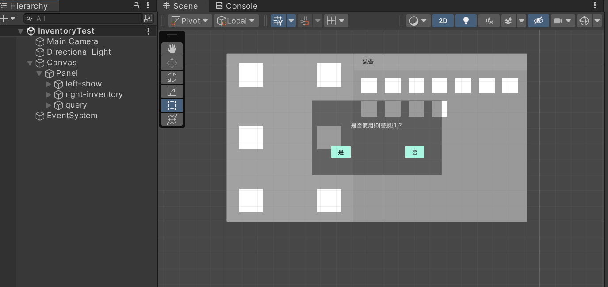
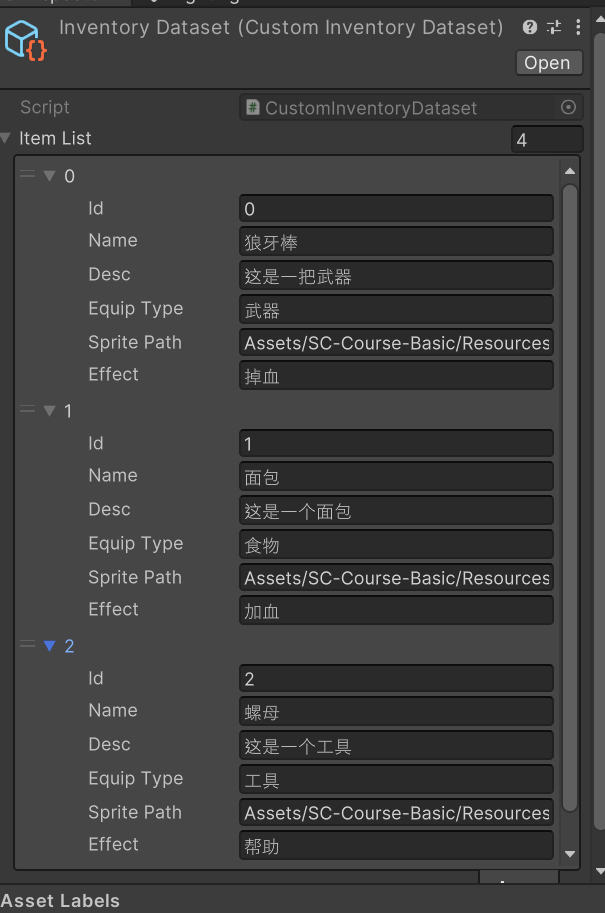
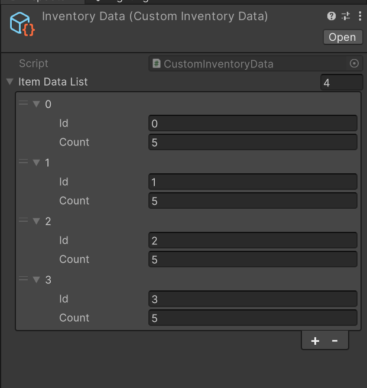
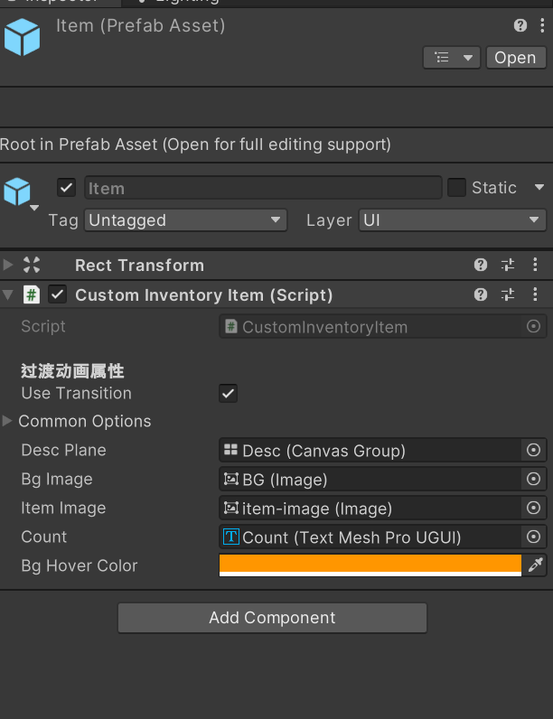
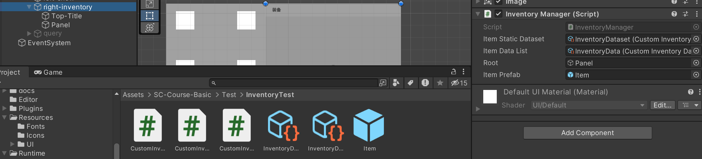
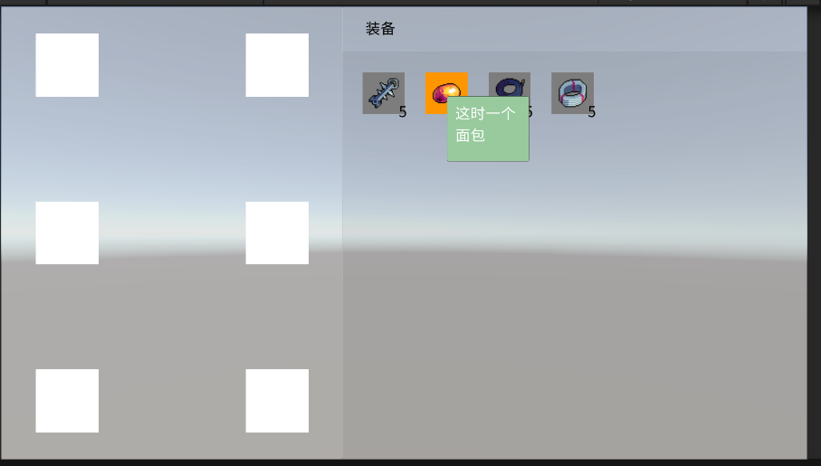

# Inventory

该模块实现了一个可拖拽的背包系统，接下来我介绍如何使用之前的 `Drag` 组件和 `LanguageLocalization` 本地化技术，一步步实现一个多语言的背包系统

最终代码可以看 `Runtime/Inventory` 文件夹下，如果想要调值背包系统的东西，只要调值 `Test/InventoryTest` 中的 `ScriptableObject` 即可。

## UI 搭建

首先我们先搭建出如下图的 UI 界面来，主要通过使用 `Grid Layout Group` 组件来实现布局



- 左边 9 个格子是用来装备物品，是固定的
- 右边的格子是用来存放各种物品，是根据用户数据动态生成的。因此这里需要一个脚本来动态生成物品，这里我们新建一个 `InventoryManager.cs` 的脚本，并挂载到 `right-inventory` 对象上
- 中间的对话框是询问当装备物品时，是否进行替换，需要提供脚本来关闭和启动询问框，并订阅是/否这两个按钮。因此也需要一个脚本来控制，这里我们新建一个 `QuerySelection.cs` 的脚本，并挂载到 `query` 对象上

### QuerySelection

为了有过渡效果，我们继承了 `AnimationUI`，并且里面的两个按钮都是自定义的 `LButton` 按钮，带有过渡效果。完整代码参考 `Runtime/Inventory/QuerySelection.cs`，这里只展示部分属性和方法

- `IsTrue` 该属性可以用来获取获取最终状态。`IsTrue=true`，代表按下是，否则代表按下否
- `UpdateContentText(Func<string, string> func)` 更新询问框的提示文字。参数是一个回调，输入字符模板，返回最终字符。字符模板是 `是否使用 {0} 替换 {1} ？`
- `Open()` 开启询问框
- `Close()` 关闭询问框

后面我们在装备物品冲突时，会开启询问框来询问用户是否进行替换

### InventoryManager

- `itemPropertyDataset` 物品静态属性库，是一个 `ScriptableObject`
- `itemDataDataset` 物品动态属性库，是一个 `ScriptableObject`
- `itemPrefab` 物品预制体
- `root` 存放物品的根对象

前面三个部分才是用户真正需要改的，下面依次介绍如何创建这些资源

#### itemPropertyDataset

物品静态属性库，表征了物品的固有属性，不随用户改变而改变。我们可以新建一个 `CustomInventoryDataset.cs`，继承自 `YLBasic.InventoryDataset<P>`，默认加载 Sheet1 表作为物品静态属性库，泛型 `P` 代表了固有属性字段。另外我们需要重写 `GetItemProperty(string Id)`

```csharp

[Serializable]
public struct ItemProperty // 物品的固有属性
{
  public string Id;
  public string Name;
  public string Desc;
  public string EquipType;
  public string SpritePath;
  public string Effect;
}

[CreateAssetMenu(fileName = "InventoryDataset", menuName = "InventoryDataset", order = 2)]
public class CustomInventoryDataset : InventoryDataset<ItemProperty>
{
  public override ItemProperty GetItemProperty(string Id)
  {
    return Sheet1.Find(item => item.Id == Id);
  }
}
```

下图是随便创建的一个物品静态属性库




#### itemDataDataset

物品动态属性库，会随着用户的改变而改变。同样我们可以新建一个 `CustomInventoryData.cs`，继承自 `YLBasic.InventoryData<D>`，默认加载 Sheet1 表作为物品动态属性库，泛型 `D` 代表了动态属性字段。另外需要重写 `GetIdentify` 属性，指明哪个字段是唯一标识，并且可以和物品静态属性库建立连接（相当于两个表的 join），

```csharp
[Serializable]
public struct ItemData
{
  public string Id;  // 1 Id 字段作为唯一标识
  public int count;
}

[CreateAssetMenu(fileName = "InventoryData", menuName = "InventoryData", order = 3)]
public class CustomInventoryData : InventoryData<ItemData>
{
  public override string GetIdentify { get => "Id"; } // 2 这里要和 1 一样
}
```

下图是随便创建的一个物品动态属性库




#### itemPrefab
 
下面我们需要制作一个物品的预制体，这样才可以动态生成，预制体上面需要挂载一个脚本 `CustomInventoryItem.cs`，继承自 `YLBasic.InventoryItem<P, B>`，其中泛型 `P` 代表物品静态数据类型，在这里就是 `ItemProperty`。泛型 `B` 代表物品动态数据类型，在这里就是 `ItemData`

- 核心方法：`Init(P itemProperty, B itemData)` 动态初始化，将数据显示在 UI 上面，后面 `InventoryManager` 负责调用来进行初始化，因此必须实现该方法
- 其余功能：hover 变色并且出现绿色描述框



当然后面为了更好的控制拖拽，我们还提供了更多的方法
- `OnBeginDrag` 由自身生成的拖拽对象开始拖拽时，拖拽对象的脚本调用该函数，自身不会调用
- `OnEndDrag` 由自身生成的拖拽对象结束拖拽时，拖拽对象的脚本调用该函数，自身不会调用
- `OnAttached` 由拖拽对象被吸附时，自身脚本调用该函数，拖拽对象的脚本不会调用
- `DisAttached` 由拖拽对象被卸载时，自身脚本调用该函数，拖拽对象的脚本不会调用


#### 挂载

因为我们的 `InventoryManager` 挂载在 `right-inventory`，因此你需要找到并进行赋值，将上面的物品静态属性库，物品动态属性库，物品预制体给 `InventoryManager` 组件，如下



运行后，你可以看到这样的结果 



## 拖拽

后面就是添加拖拽功能了，后面的功能基本都是通过 `InventoryManager` 内部实现的，用户可以不需要管原理，如果你不想继续深入了解，那么这里就可以结束了，因此拖拽功能是自带的，不需要用户手动设置获取挂载脚本


<video id="video" controls="false" preload="none" style="width:100%;" poster="./imgs/inventory/poster.png">
  <source id="mp4" src="./imgs/inventory/results-min.mp4" type="video/mp4">
</videos>