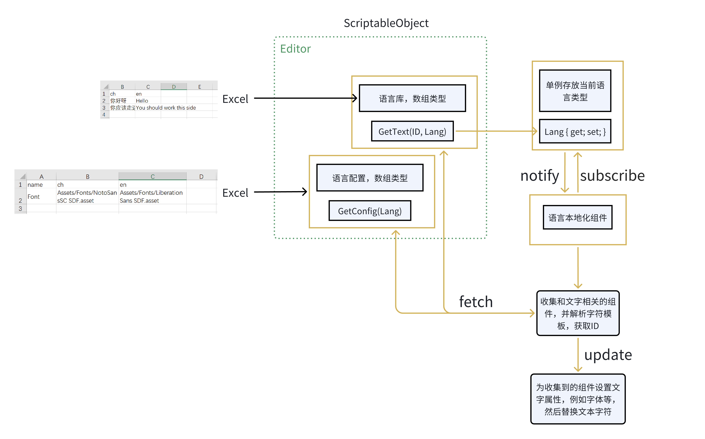
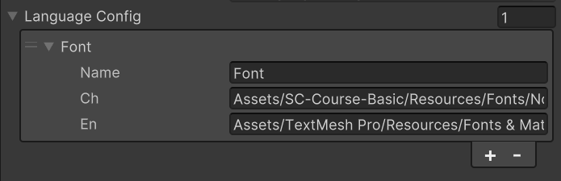

# LanguageLocalization

该模块实现了基本的语言本地化的功能，支持多语言配置

## Localization

该类负责提供一个全局单例来存储当前语言类型，并且提供静态方法类控制当前语言类型

#### GetLang()

获取当前的语言类型

```csharp
static string GetLang()
```

#### SetLang()

设置当前的语言类型，会通知订阅者

```csharp
static void SetLang(string lang)
```

#### Subscribe()

订阅语言类型的改变

```csharp
static void Subscribe(Action<string> watcher)
```

#### UnSubscribe()

取消订阅语言类型的改变

```csharp
static void UnSubscribe(Action<string> watcher)
```

## LocalizationComponent

该组件需要挂载到需要语言本地化功能的 UI 对象的根对象上，例如 `Canvas` 对象上。默认会收集自身和子对象上和 `Text` 相关的组件，并进行实时的语言更新。

<mark>Tip:</mark> 使用 `{ID}` 来占位，你需要更新语言的部分。例如下面几个例子，假设我们现在有语言库，库中只有两条记录

```json
[
  {"en":"Say","ch":"说"}
  {"en":"Eat","ch":"吃"}
]
```

那么下面的文本将会根据设置的语言类型进行翻译，注意只有 `{ID}` 这部分才会进行翻译，其余保持不变

```
{1}  // en --> "Eat"， // ch --> "吃"
Toggle {0} sss {1}  // en --> Toggle Say sss Eat ， // ch --> Toggle 说 sss 吃
```

### Attributes

- `languageDataset` 用于存放加载语言库的 `ScriptObject`
- `languageConfig` 用于存放不同语言类型配置的 `ScriptObject`
- `onlySelf` 是否只收集自身组件，默认 `false`，也就是会收集子组件
- `subscribe` 是否订阅语言类型的改变，默认 `true`
- `lang` 当不订阅时，可以手动设置使用什么语言类型

### Methods

一些动态更新的方法

#### SetOnlySelf()

设置是否只收集自身组件，会去更新收集到的组件

```csharp
void SetOnlySelf(bool onlySelf)
```

#### SetSubscribe()

设置是否订阅语言类型的改变，`false` 将取消监听

```csharp
void SetSubscribe(bool subscribe)
```

#### SetLang()

设置当前使用的语言类型并更新文字。注意只有在 `subscribe=false` 才起作用。而且该方法并不会更新全局单例的语言类型

```csharp
void SetLang(string lang)
```

## LanguageDataset

该类是一个 `ScriptableObject`，不需要实例化，是做为基类用来存贮语言库的。使用如下

```csharp
[Serializable]
public class LanguageSentence
{
  public string ch;  // 定义语言字段，和 Excel 中的字段保持一致
  public string en;
}

[CreateAssetMenu(fileName = "CustomLanguage", menuName = "LanguageDataset", order = 0)]
public class CustomLanguage : LanguageDataset<LanguageSentence> { }
```

这样创建出来的 `CustomLanguage` 默认是读取 Excel 中的 `languageSentences` Sheet 做为语言库的。如果你想设置多个语言库组，可以多声明几个变量即可，注意变量名和 Sheet 名字一致，如下

```csharp
[CreateAssetMenu(fileName = "CustomLanguage", menuName = "LanguageDataset", order = 0)]
public class CustomLanguage : LanguageDataset<LanguageSentence> { 
  public List<LanguageSentence> Sheet1; // 和 Excel 中的 Sheet 名字一致
  public List<LanguageSentence> Sheet2;

  public override string GetText(int id, string lang)
  {
    LanguageSentence sentence = Sheet2[id];
    var res = Reflect.get(sentence, lang);
    return res is ReflectNotFoundError ? (res as ReflectNotFoundError).Message : res as string;
  }
}
```

同时别忘了，重写一下 `GetText` 方法，以确保可以从正确的 Sheet 中读取文本。

- 需要准备一个字体包含了各种语言类型，这样才加载的出来，目前还不支持根据语言类型设置不同的语言字体，后续会加入（同样使用 ScriptableObject）
- Excel 转 `ScriptableObject` 插件使用的是 <a href="https://github.com/mikito/unity-excel-importer/tree/v0.1.1/upm">`Unity Excel Importer`</a>


#### Methods

`GetText()` 方法我们提供了许多重载，可以不传 `lang` 参数，则使用全局单例的语言类型

```csharp
public string GetText(int id)
{
  return GetText(id, Localization.GetLang());
}

public string GetText(string id)
{
  return GetText(id, Localization.GetLang());
}

public string GetText(string id, string lang)
{
  return GetText(int.Parse(id), lang);
}
```

## 流程图



## LanguageConfig

语言配置的 `ScriptableObject`，使用如下

```csharp
[Serializable]
public class LanguageConfigST
{
  public string name;  // 1
  public string ch; 
  public string en;
}

[CreateAssetMenu(fileName = "LanguageConfig", menuName = "LanguageConfig", order = 1)]

public class CustomLanguageConfig : LanguageConfig<LanguageConfigST>
{
  public override string ConfigName { get => "name"; }  // 2 需要和 1 对应起来
}
```

配置如下，也是一个数组，数组每一项代表了不同配置



#### GetConfig()

返回对应语言的配置字典。Key 表示配置的属性，例如 `Font`，也就是上面的 `Name` 字段。Value 表示属性的资源路径

```csharp
Dictionary<string, string> GetConifg(string lang)
```